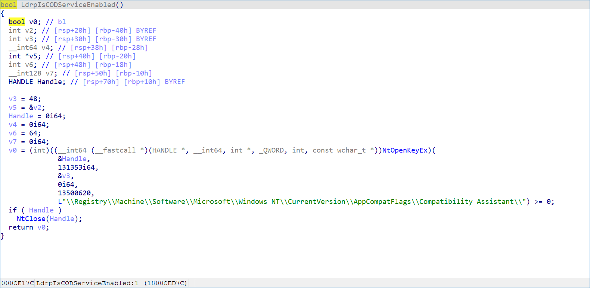
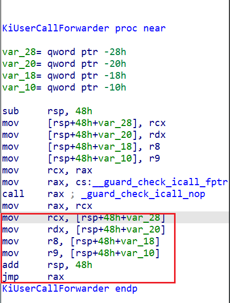
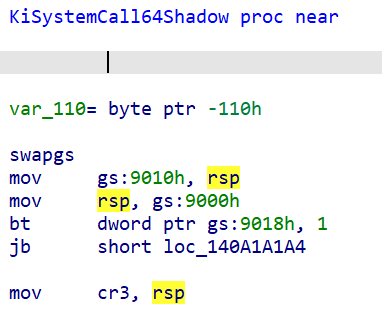
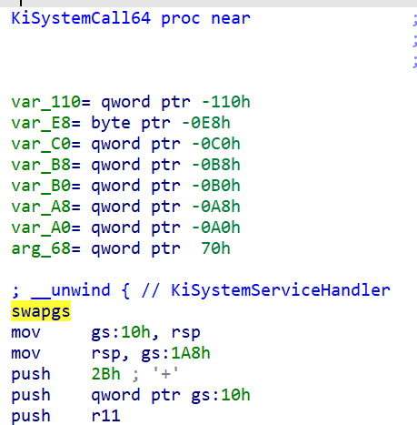
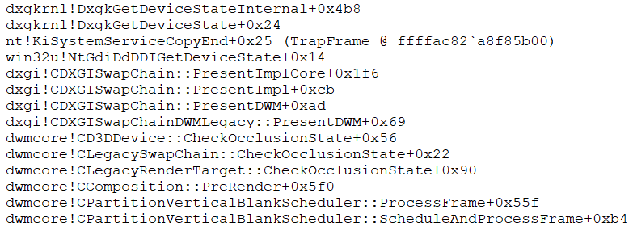
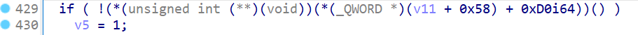
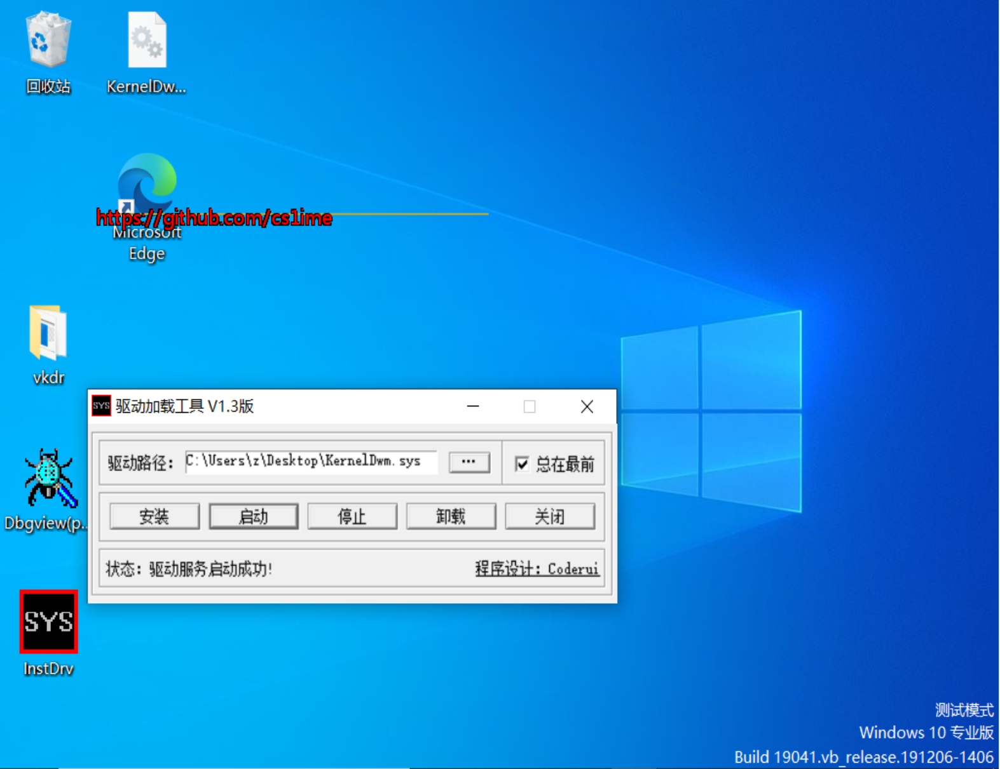

# 记一次仿写内核DWM绘制

Github仓库地址: https://github.com/cs1ime/KernelDwm

**本文中涉及到的技术与源码不得用于非法用途!**

## 逆向DoubleCallback

之前在Github上看到了一个有意思的仓库 https://github.com/wbaby/DoubleCallBack

有三次commit,原作者应该就是busy10了

原理是内核层调用用户层dwm的DirextX11 vtable函数,用户层把vtable里的函数替换成ntdll里的`LdrpIsCODServiceEnabled`触发内核中的注册表回调



接着调用vtable里的函数实现绘制,伪代码如下

```c++

ID3D11Texture2D* SurfaceD3D11 = 0;
pSwapChain->GetBuffer(0, __uuidof(ID3D11Texture2D), (void**)&SurfaceD3D11);

D3D11_TEXTURE2D_DESC desc = { 0 };
SurfaceD3D11->GetDesc(&desc);
desc.BindFlags = 0;
desc.MiscFlags = 0;
desc.Usage = D3D11_USAGE_STAGING;
desc.CPUAccessFlags = D3D11_CPU_ACCESS_READ | D3D11_CPU_ACCESS_WRITE;
ID3D11Texture2D* Texture = 0;
pd3dDevice->CreateTexture2D(&desc, 0, &Texture);
pd3dDeviceContext->CopyResource(Texture, SurfaceD3D11);

D3D11_MAPPED_SUBRESOURCE MapRes = { 0 };
pd3dDeviceContext->Map(Texture, 0, D3D11_MAP_READ_WRITE, 0, &MapRes);

ByteRender(MapRes.pData);

pd3dDeviceContext->Unmap(Texture, 0);
pd3dDeviceContext->CopyResource(SurfaceD3D11, Texture);

Texture->Release();
SurfaceD3D11->Release();
```

不知为啥DirextX11能把Texture copy进Surface里面,DirextX12就不行了...总之DWM应该会一直使用DirextX11的,一个融合器也没必要上DirextX12这么复杂的API

这里的绘制实现是CPU写像素,安排上图形学的算法就行,busy10大佬已经帮我们写好基本的算法了 https://github.com/wbaby/DoubleCallBack/blob/master/DoubleCallback/LegacyRender.h


## 仿写

难点主要集中在内核层调用用户层和hook dwm


### 内核层调用用户层

Windows提供的内核层调用用户层的标准函数是`KeUserModeCallback`

这里找到一篇文章分析这个函数 https://www.anquanke.com/post/id/184233#h2-1

只需要看 `KiCallUserMode` 的实现就行了,由于sysret将rcx作为了返回用户模式地址的寄存器,那就要返回用户层的时候要先跳到`KiUserCallForwarder`的后半段以实现从栈上获取到预先设定好的Windows x64调用约定中前4个由寄存器传递的参数(rcx,rdx,r8,r9)



sysret之前把rax设为目标函数地址,返回地址设定为`NtCallbackReturn` 即可。

关于`KeUserModeCallback`还额外需要申请一个内核栈,个人猜测应该是内核层回到用户层调用函数的时候,函数里面又要调用一些API进内核需要一个全新的栈。

对于kvashadow的gs:[xxxx]偏移,切换堆栈的时候必须涉及到这个,kvashadow是用来防幽灵熔断漏洞的,看了一下这个漏洞的实现原理,想要防只能给用户模式单独做一张没有内核模式敏感信息的页表,正常渠道进内核就用正常的页表

所以`IA32_LSTAR`的值肯定是由系统根据有无开启kvashadow自动分配的

开了kvashadow的syscall入口函数:



没开kvashadow的syscall入口函数:



`IA32_LSTAR` 记录的syscall地址如果开了kvashadow就是`KiSystemCall64Shadow`,没开就是`KiSystemCall64`,再加上一个固定偏移就能完美定位

实现代码:

```c++
ULONG_PTR pSyscall = ((ULONG_PTR)AsmReadMsr(0xC0000082));
ULONG offset = *(ULONG*)(pSyscall + 8);
offset &= 0xFF00;
g_offset_stack = offset + 8;
if (offset != 0) {
	g_kvashadow = 1;
}
else {
	g_kvashadow = 0;
}
```


### Hook dwm

经过Infhook测试发现DirextX11在Present之后必定会调用`NtGdiDdDDIGetDeviceState`,而这个函数在内核层是可被Hook的

完整栈回溯如下图



hook点位于`DxgkGetDeviceStateInternal`返回时机通过`Process->DxgkProcess`中的函数表调用`UserScreenAccessCheck`





### 实现

.png)

## 效果截图





## 检测对抗方案

1. 检测Hook
2. 通过插入APC+栈回溯监控DWM进程中的所有线程,由于绘制占用的时间片多,Hook回调执行期间肯定会陷入时钟中断从而触发APC,就算回调执行期间关闭中断,那绘制执行期间dx11调用的各种内核函数也会将中断开启造成检测方向,这是一个非常大的弱点
3. NMI+栈回溯

